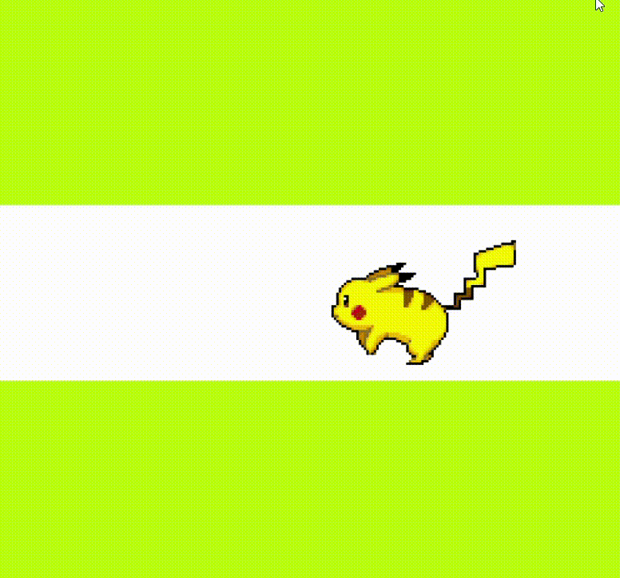

<div align="center" id="top">
     
</div>
# <h1 align="center">Run Pika</h1>

<p align="center">
  <a href="#dart-description">Description</a> &#xa0; | &#xa0; 
  <a href="#dart-demo">Demo</a> &#xa0; | &#xa0;
  <a href="#memo-improvements">Improvements</a> &#xa0; | &#xa0;
  <a href="#art-technologies">Technologies</a> &#xa0; | &#xa0;
  <a href="#white_check_mark-requirements">Requirements</a> &#xa0; | &#xa0;
  <a href="#toolbox-installation">Installation</a> &#xa0; | &#xa0;
  <a href="#joystickhow-to-play">How to Play</a> &#xa0; | &#xa0;
  <a href="#briefcase-license">License</a> &#xa0; | &#xa0;
  <a href="https://github.com/arturomsoberanes" target="_blank">Author</a>
</p>

<br>

## :dart: Description

Run Pika is a simple animation of the most famous pokemon
pikachu running is a good proyect for see how we can work
with the DOM with JavaScript

## :dart: DEMO

If you want to try it just click [here](https://arturomsoberanes.github.io/run_pika)

## :memo: Improvements

These are the list of currect improvements:

- :diamonds: Add another elements.
- :diamonds: Convert it in a video game.

## :art: Technologies

- [HTML](https://www.w3schools.com/html/)
- [CSS](https://www.w3schools.com/css/)
- [JavaScript](https://www.w3schools.com/js/)

## :white_check_mark: Requirements

Before starting :checkered_flag:, you need to have:

- [Git](https://git-scm.com).

## :toolbox: Installation

Clone Repository

```bash
$ git clone https://github.com/arturomsoberanes/run_pika.git
```

## :joystick: How to Run

Access in directory

```bash
$ cd run_pika
```

And open the index.html

## :briefcase: License

This project is under license from MIT. For more details, see the [LICENSE](LICENSE) file.

Made with :heart: by <a href="https://github.com/arturomsoberanes" target="_blank">Arturo Soberanes</a>

&#xa0;

<a href="#top">Back to top</a>
